# GB Studio 3.0 - Plugin Pak

A set of experimental plugins for GB Studio 3.0. Use them at your own risk :)

## Dialogue & Menus

### Display Advanced Dialogue

Show a dialogue box at the bottom of the game screen.

The `Text` tab behaves exactly like the **Display Dialogue** event.

The `Layout` tab allows to configure multiple options for the dialogue box:

- Minimum and maximum height of the display box, and if the border should be rendered or not.
- The initial position of the text.
- The maxmimum number of lines before the text will start scrolling up.
- Configure when the dialogue will close:
  - When a button is pressed
  - When the text finishes rendering
  - Never (the dialogue box will remain on screen and allow other interactions. The dialogue can be hidden using the **Hide Overlay** or **Overlay Move To** events).
- If the previous content should be removed when displaying the dialogue. This is useful to avoid the text flickering when dialogue boxes are open with Instant speed.

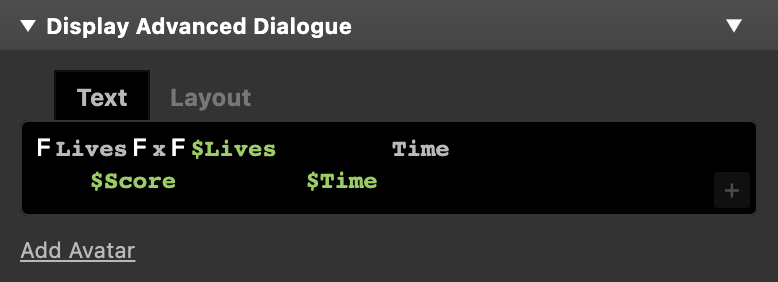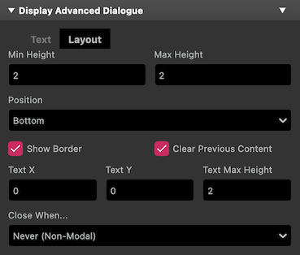

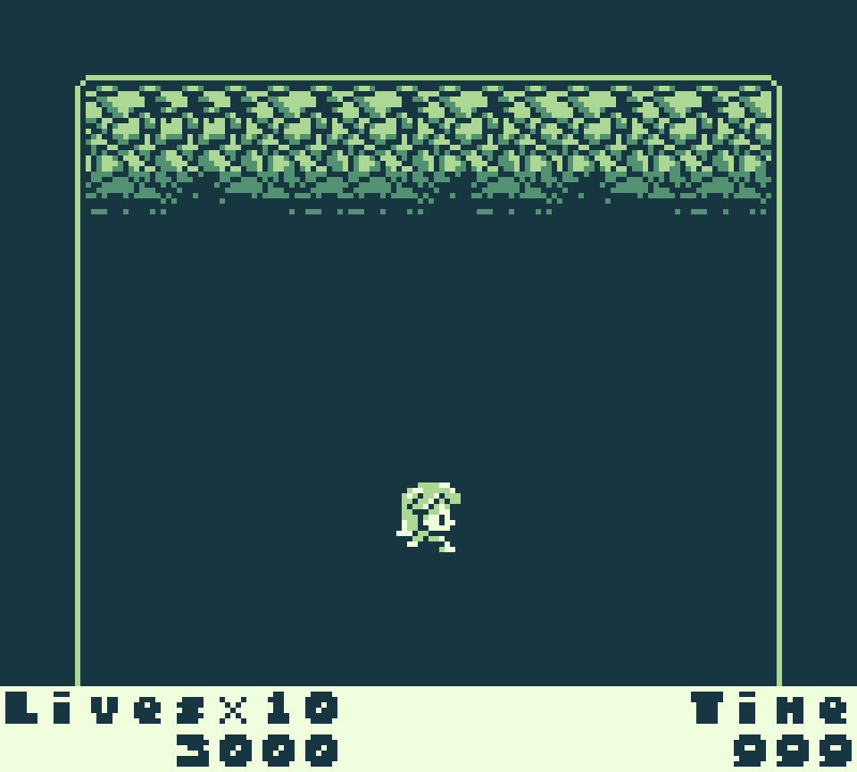

### Display Advanced Menu

Display a menu of multiple options and set the specified variable to the value of the chosen option.

Menu option position and navigation order can be set for each item in the `Items` tab. The dialogue box size and the opening and closing direction can be set in the `Layout` tab.

There's no maximum character length per item, but the total amount of displayed characters is limited to by the number of tiles reserved for UI text (52 for non-color mode).

_Note:_ The event can get very long when there's a lot of items.

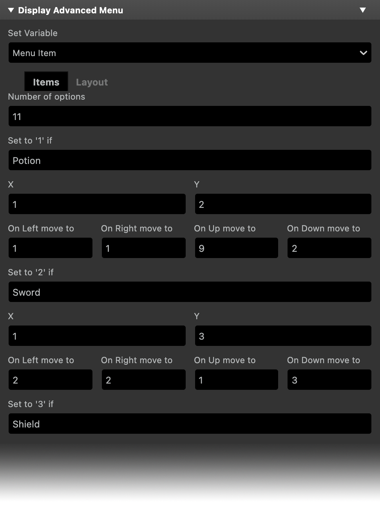 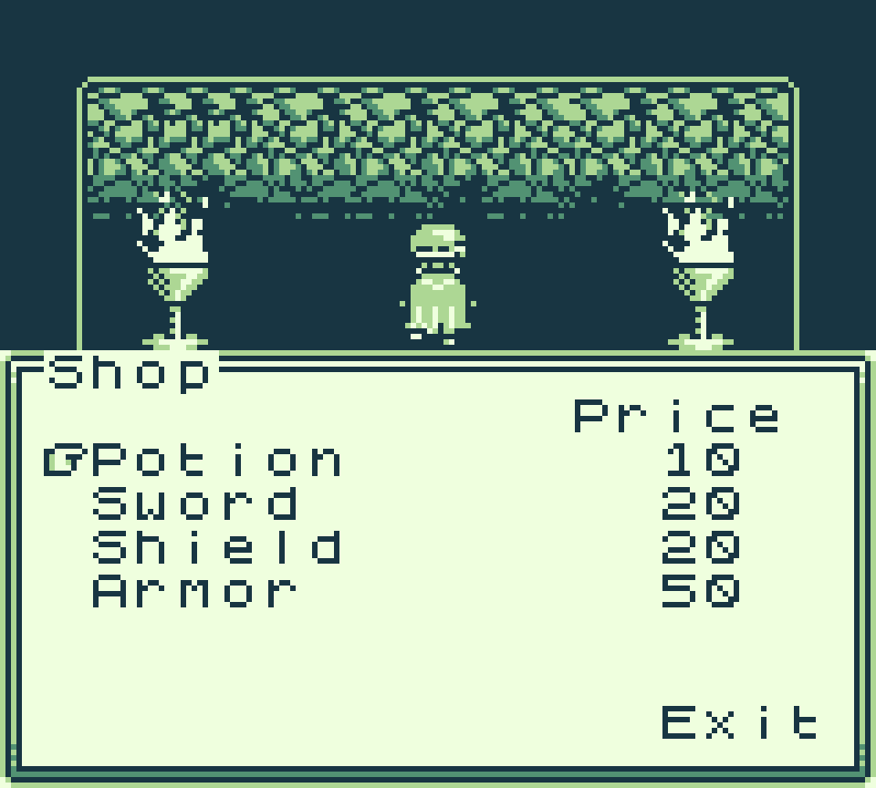

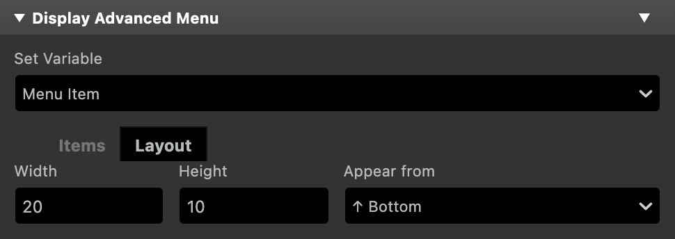

### Display Background Text

Renders a line of text at a specified position in the scene background.

There's no maximum character length for the text, but the total amount of displayed characters in a scene is limited to by the number of tiles reserved for UI text (52 for non-color mode), this includes text displayed with this event but also any other dialogue or menu.

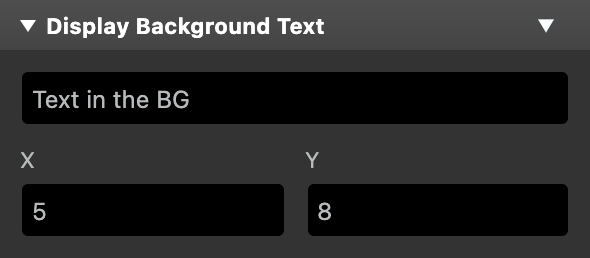

## Real Time Clock

A set of events that give access to the Real Time Clock functionality present in some GB cartridges.

_Note:_ Cartridge type needs to be set to `MBC3` in the project Settings, for RTC to work.

### Set Clock Time

Set the values of the real time clock fields with a number or the value of a variable.

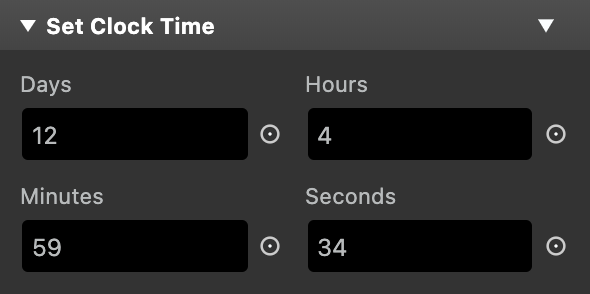

### Store Clock Time In Variables

Store the current time in one variable for each value.

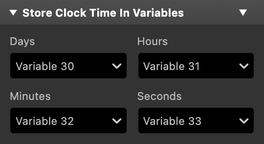

### Start Clock

Starts the real time clock.

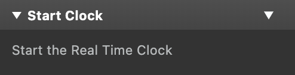

### Stop Clock

Stops the real time clock.

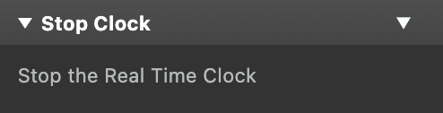

## Music & Sound Effects

### Mute Channel

Mutes one or more channels for the currently playing music.

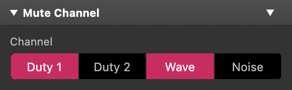

## How to Install

Drop the `plugins` folder in your project. All the above events will be available from the `Add Event` button.
