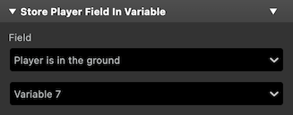
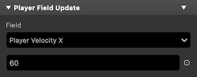
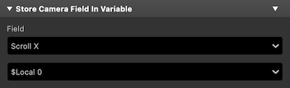
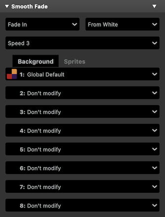

# GB Studio 4.1 - Plugin Pak

A set of experimental plugins for GB Studio 4.1. Use them at your own risk :)

> [!NOTE] 
> A handful of previously available event plugins are now deprecated as their functionlity is part of GB Studio. [See the list below](#deprecated-plugins).

## Dialogue & Menus

### Display Advanced Menu

Display a menu of multiple options and set the specified variable to the value of the chosen option.

Menu option position and navigation order can be set for each item in the `Items` tab. The dialogue box size and the opening and closing direction can be set in the `Layout` tab.

There's no maximum character length per item, but the total amount of displayed characters is limited to by the number of tiles reserved for UI text (52 for non-color mode).

_Note:_ The event can get very long when there's a lot of items.

 

## Real Time Clock

A set of events that give access to the Real Time Clock functionality present in some GB cartridges.

_Note:_ Cartridge type needs to be set to `MBC3` in the project Settings, for RTC to work.

### Set Clock Time

Set the values of the real time clock fields with a number or the value of a variable.

### Store Clock Time In Variables

Store the current time in one variable for each value.

### Start Clock

Starts the real time clock.

### Stop Clock

Stops the real time clock.

## Player Fields

### Store Player Field In Variable

Store the value of a Player Field in a variable.

The available fields are:

- Platformer scenes:
  - `Player Velocity X`: Current horizontal velocity for the player.
  - `Player Velocity Y`: Current vertical (jumping) velocity for the player.
  - `Player is in the ground`: `1` if the player is jumping or `0` if it's not.
  - `Player is on ladder`: `0` if the player is on a ladder or `1` if it's not.

### Player Field Update

Change the value of a Player Field.

The available fields are:

- Platformer scenes:
  - `Player Velocity X`: Current horizontal velocity for the player.
  - `Player Velocity Y`: Current vertical (jumping) velocity for the player.

## Camera

### Store Camera Field In Variable

Store the value of a Camera Field in a variable.

The available fields are:

- `Camera X`: Current horizontal camera position.
- `Camera Y`: Current vertical camera position.
- `Scroll X`: Current horizontal scroll position.
- `Scroll Y`: Current vertical scroll position.
- `Camera Deadzone X`: Current horizontal edge for the camera window.
- `Camera Deadzone Y`: Current vertical edge for the camera window.
- `Camera Offset X`: Current horizontal camera position relative to the edge of the screen.
- `Camera Offset Y`: Current vertical camera position relative to the edge of the screen.

## Screen

### Smooth Fade

**Color Mode Only**

Fade some or all of the current scene's background or sprites palettes to or from a white or black screen, interpolating the color values for a smooth fade.

## β Plugins

The plugins in this category are even more experimental than the ones above and might change in the future.

- **Move Variable Actor To** and **Store Variable Actor Position In Variables**:
  - These events duplicate existing GB Studio Actor events but instead of using a dropdown to select the actor they use a variable. The value of the variable represents the index of the actor in the scene (the player is always `0` and the rest of the actors have an index assigned based on when they were added to the scene).
- **Pin Actor to Screen** and **Unpin Actor from Screen**:
  - Pin or Unpin the actor to its current screen coordinates. Be aware of the current state of the actor: If it's already pinned or unpinned when the event is called its position will be wrongly offset based on the scroll position.

## How to Install

Drop the `plugins` folder in your project. All the above events will be available from the `Add Event` button.

## More plugins from other authors:

- [NalaFala (Yousurname)'s GB Studio Plugin Collection](https://github.com/Y0UR-U5ERNAME/gbs-plugin-collection)
- [Platformer+](https://github.com/becomingplural/GBS_PlatformerPlus)
- [Advanced Dialog and Menu vB](https://github.com/dochardware/Advanced-Dialog-and-Menu)
- [Shin's GB Studio plugins](https://github.com/shin-gamedev/gbs-plugins)
- [Gud GBS Plugins](https://github.com/mikeleisz/gud_gbs_plugins)
- [Fade Street](https://gearfo.itch.io/fade-street)
- [Scroll Scene transition](https://github.com/Mico27/GBS-scrollScenePlugin) and more [Mico27's plugins](https://github.com/Mico27/)

## Deprecated Plugin Events

The following event plugins aren't available as part of the Plugin Pak anymore as their functionality has been added to GB Studio natively.

Since 4.1:
- Display Advanced Dialogue
- Display Background Text
- Print Screen Background
- Mute Channel
- Camera Field Update
- Set Dialogue Frame
- Actor FX

Since 4.0:
- Locked Event Group
- Unlocked Event Group

If you're not using GB Studio 4.1 or above, you can still find the above [here](https://github.com/pau-tomas/gb-studio-plugins/tree/4.0).