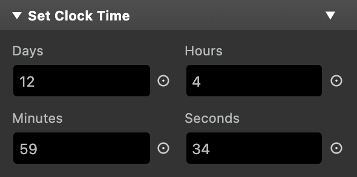
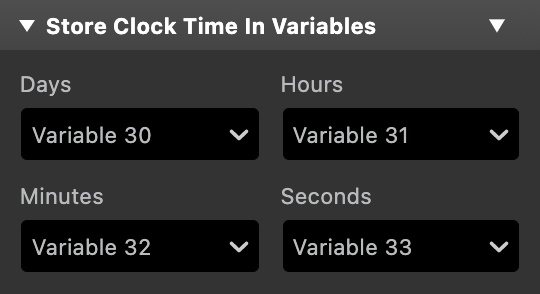
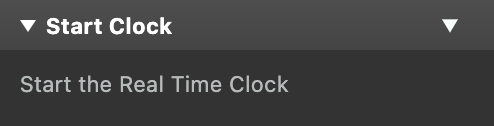
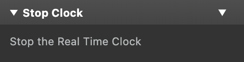

  

    
🌐 Language

    

      

        <a href="https://openaitx.github.io/view.html?user=pau-tomas&project=gb-studio-plugins&lang=en">English</a>
        | <a href="https://openaitx.github.io/view.html?user=pau-tomas&project=gb-studio-plugins&lang=zh-CN">简体中文</a>
        | <a href="https://openaitx.github.io/view.html?user=pau-tomas&project=gb-studio-plugins&lang=zh-TW">繁體中文</a>
        | <a href="https://openaitx.github.io/view.html?user=pau-tomas&project=gb-studio-plugins&lang=ja">日本語</a>
        | <a href="https://openaitx.github.io/view.html?user=pau-tomas&project=gb-studio-plugins&lang=ko">한국어</a>
        | <a href="https://openaitx.github.io/view.html?user=pau-tomas&project=gb-studio-plugins&lang=hi">हिन्दी</a>
        | <a href="https://openaitx.github.io/view.html?user=pau-tomas&project=gb-studio-plugins&lang=th">ไทย</a>
        | <a href="https://openaitx.github.io/view.html?user=pau-tomas&project=gb-studio-plugins&lang=fr">Français</a>
        | <a href="https://openaitx.github.io/view.html?user=pau-tomas&project=gb-studio-plugins&lang=de">Deutsch</a>
        | <a href="https://openaitx.github.io/view.html?user=pau-tomas&project=gb-studio-plugins&lang=es">Español</a>
        | <a href="https://openaitx.github.io/view.html?user=pau-tomas&project=gb-studio-plugins&lang=it">Italiano</a>
        | <a href="https://openaitx.github.io/view.html?user=pau-tomas&project=gb-studio-plugins&lang=ru">Русский</a>
        | <a href="https://openaitx.github.io/view.html?user=pau-tomas&project=gb-studio-plugins&lang=pt">Português</a>
        | <a href="https://openaitx.github.io/view.html?user=pau-tomas&project=gb-studio-plugins&lang=nl">Nederlands</a>
        | <a href="https://openaitx.github.io/view.html?user=pau-tomas&project=gb-studio-plugins&lang=pl">Polski</a>
        | <a href="https://openaitx.github.io/view.html?user=pau-tomas&project=gb-studio-plugins&lang=ar">العربية</a>
        | <a href="https://openaitx.github.io/view.html?user=pau-tomas&project=gb-studio-plugins&lang=fa">فارسی</a>
        | <a href="https://openaitx.github.io/view.html?user=pau-tomas&project=gb-studio-plugins&lang=tr">Türkçe</a>
        | <a href="https://openaitx.github.io/view.html?user=pau-tomas&project=gb-studio-plugins&lang=vi">Tiếng Việt</a>
        | <a href="https://openaitx.github.io/view.html?user=pau-tomas&project=gb-studio-plugins&lang=id">Bahasa Indonesia</a>
        | <a href="https://openaitx.github.io/view.html?user=pau-tomas&project=gb-studio-plugins&lang=as">অসমীয়া</
      

    

  

# GB Studio 4.2 - Plugin Pak

A set of experimental plugins for GB Studio 4.2. Use them at your own risk :)

> [!NOTE]
> A handful of previously available event plugins are now deprecated, as their functionality is part of GB Studio. [See the list below](#deprecated-plugins).

## Dialogue & Menus

### Draw Lifebar

Draw a (life/power/mana)bar to a specified position on the overlay.

- `X`, `Y`: Tile coordinates on the overlay.
- `Tileset`: A tileset that includes the tiles for the bar in consecutive order.
- `Tile`: The first tile of the bar in the tileset (usually the empty tile).
- `Value`: The current value to be represented by the bar.
- `Max Value`: The maximum value that can be represented by the bar.
- `Steps`: The number of tiles needed to "fill" an item in the bar (not including the empty one).

[Example project](examples/Draw%20Lifebar/)

_Note:_ The tileset will load at tile 128 of VRAM (right after the sprites block). This allows combining lifebar rendering with `Draw Text` on the overlay. The VRAM index can be changed by editing the `const VRAM_BASE_START_TILE = 128` line in the plugin file.

### Display Advanced Menu

Display a menu of multiple options and set the specified variable to the value of the chosen option. Menu option position and navigation order can be set for each item in the `Items` tab. You can optionally set the 'B' button to close the menu setting the variable to '0' and can also make the last menu item return '0' when selected. The dialogue box size, opening and closing direction, and the position of the menu (top or bottom) can be set in the `Layout` tab. The opening and closing speed of the menu can be set in the `Behavior` tab.

There's no maximum character length per item, but the total number of displayed characters is limited by the number of tiles reserved for UI text (52 for non-color mode).

_Note:_ The event can become very long when there are many items.

 

## Real Time Clock

A set of events that provide access to the Real Time Clock functionality present in some GB cartridges.

_Note:_ Cartridge type needs to be set to `MBC3` in the project settings for the RTC to work.

### Set Clock Time

Set the values of the real time clock fields to a number or the value of a variable.

### Store Clock Time In Variables

Store the current time in one variable for each value.

### Start Clock

Starts the real time clock.

### Stop Clock

Stops the real time clock.

## Screen

### Smooth Fade

**Color Mode Only**

Fade some or all of the current scene's background or sprite palettes to or from a white or black screen, interpolating the color values for a smooth fade.

## β Plugins

The plugins in this category are even more experimental than the ones above and might change in the future.

- **Move Variable Actor To** and **Store Variable Actor Position n Variables**:
  - These events duplicate existing GB Studio Actor events, but instead of using a dropdown to select the actor, they use a variable. The value of the variable represents the index of the actor in the scene (the player is always `0`, and the rest of the actors have an index assigned based on when they were added to the scene).

- **Pin Actor to Screen** and **Unpin Actor from Screen**:
  - Pin or unpin the actor to its current screen coordinates.\nBe aware of the current state of the actor: if it's already pinned or unpinned when the event is called, its position will be wrongly offset based on the scroll position.

## How to Install

Drop the `plugins` folder into your project. All the above events will be available from the `Add Event` button.

## More plugins from other authors:

- [NalaFala (Yousurname)'s GB Studio Plugin Collection](https://github.com/Y0UR-U5ERNAME/gbs-plugin-collection)
- [Platformer+](https://github.com/becomingplural/GBS_PlatformerPlus)
- [Advanced Dialog and Menu vB](https://github.com/dochardware/Advanced-Dialog-and-Menu)
- [Shin's GB Studio plugins](https://github.com/shin-gamedev/gbs-plugins)
- [Gud GBS Plugins](https://github.com/mikeleisz/gud_gbs_plugins)
- [Fade Street](https://gearfo.itch.io/fade-street)
- [Scroll Scene transition](https://github.com/Mico27/GBS-scrollScenePlugin) and more [Mico27's plugins](https://github.com/Mico27/)

## Deprecated Plugin Events

The following event plugins are no longer available as part of the Plugin Pak, as their functionality has been added to GB Studio natively.

Since 4.2:

- Player Field Update
- Store Player Field In Variable
- Store Camera Field In Variable

Since 4.1:

- Display Advanced Dialogue
- Display Background Text
- Print Screen Background
- Mute Channel
- Camera Field Update
- Set Dialogue Frame
- Actor FX

Since 4.0:

- Locked Event Group
- Unlocked Event Group

If you're not using GB Studio 4.2 or above, you can still find the above [here](https://github.com/pau-tomas/gb-studio-plugins/tree/4.1). For plugins compatible with 4.0 check [here](https://github.com/pau-tomas/gb-studio-plugins/tree/4.0)
